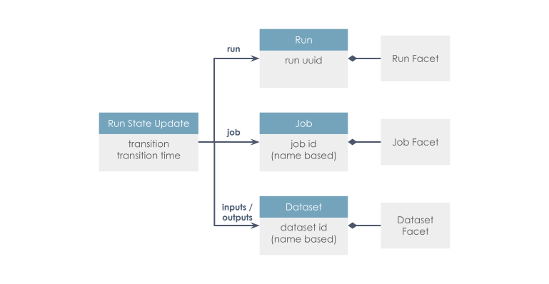

# brightway-data-lineage

Hackathon Results

Group Data Lineage (by https://github.com/FRaymand and https://github.com/cswh)

If you are interested in data lineage within LCA and brightway workflows, please participate in our discussion:

https://github.com/brightway-lca/brightway2/discussions/87

## What is data lineage?
Data lineage is the process of tracking data over time, recording its origin, how it has changed, and its final destination within the data pipeline. One can implement data lineage through any of the following approaches:
- Pattern-based lineage: evaluates metadata without consideringthe code used to generate data and detects instances of data by assessing their similarity
- Data tagging: data is tagged by a transformation engine, suited for cloed systems
- Self-contained: data lakes can inherently provide lineage, although they are closed systems
- Parsing: logic used to process data is read automatically, but complex to deploy

[Openlineage](https://openlineage.io/) provides an open standard for data lineage collection and analysis. It tracks metadata about datasets, jobs, and runs, using a consistent naming strategy. The core lineage model is extensible by defining specific facets to enrich those entities, as seen below:

                              
In this package, we use openlineage's python client, which uses the self-contained approach, to add function-logging capabilities to [brightway](https://github.com/brightway-lca/brightway25), by decorating functions with a function that uses the openlineage client to log data lineage.

## Data lineage in the context of LCA
LCA data comes from various sources and gets changed around along the way, and might influence results in not-so-clear ways. It would therefore be useful to know where each piece of data comes from, what it has undergone and be able to reproduce projects with certainty and ease. Data lineage essentially let's us keep track of the lide cycle of our life cycle data!

## Use cases of this package

|id        | As                   | I want to                                                 | So that                                          |       |
| :---:    |  :---:               |  :---:                                                    |  :---:                                           |  :---:|
| 01       | user of Brightway    | trace back shared projects                                | I can reproduce them easily                      |       |
| 02       | user of Brightway    | keep track of database changes & versions                 | make informed decisions                          |       |
| 03       | ......               | .....                                                     | ......                                           |       |
| 04       | ....                 | ........                                                  | .........                                        |       |

## Examples
We demonstrate two examples of the usage of this package. We export event information to the Marquez environment (locally-run HTTP), where following screenshots are taken from. Keep in mind, that we can also export information in JSON files without the GUI.
### Basic Example
Here a simple CSV file is imported, run through a fewdecorated user-defined function (multiplication by 2, removing the first column of dataframe, transposing) and at each stage dataset and job information is recorded.
Layout of the marquez environment with graphical representation of data lineage:

Job events can be viewed separately:

Or, by clicking on a job in the GUI:

The same goes for Datasets:

### Ecoinvent example
For this example, we use Brightway IO to import ecoinvent and apply strategies brought in the package. We first decorate all functions within the package with our logging function (Bit of an overkill, but for demo purposes) and run the code as is. 
Similar screenshots are brought for this example below:

NB: currently, we run into a maximum recursion error which we're trying to solve. If you can help, that'd be appreciated :D
